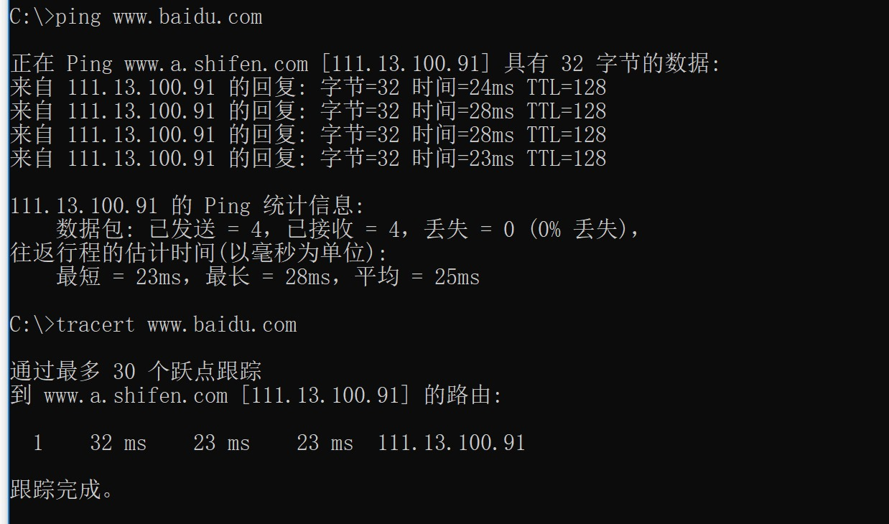
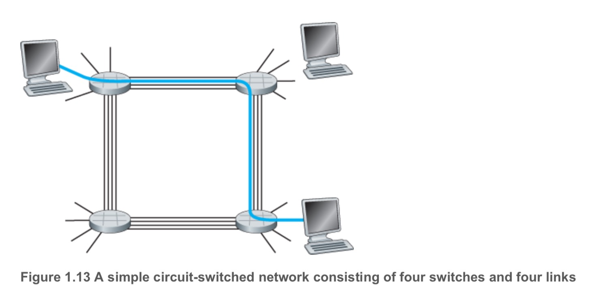
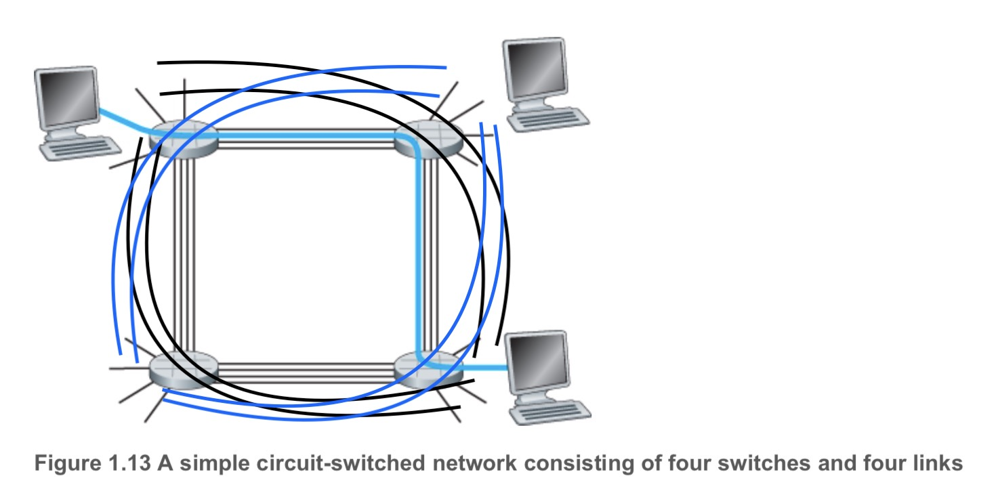

# Report of First Homework of Computer Network Course

卓越二班-2016302580264-黎冠延

## ping & tracert

## Chapter 1
### P2
Equation 1.1 gives a formula for the end-to-end delay of sending one packet of length L
over N links of transmission rate R. Generalize this formula for sending P such packets back-to-
back over the N links.

> Equation 1.1: $d_{end-to-end} = N \frac L R$

#### Answer:
Because at the time $N\frac L R$, the first package has reached the end, while the next one is in the node just before the target node, so, by just $\frac L R$, it will be in the target node.

So, the answer is:
$$ N \frac L R + (P - 1) \frac L R $$
or:
$$ (N + P - 1) \frac L R $$

## P3
Consider an application that transmits data at a steady rate (for example, the sender
generates an N-bit unit of data every k time units, where k is small and fixed). Also, when such an application starts, it will continue running for a relatively long period of time. Answer the
following questions, briefly justifying your answer:

a. Would a packet-switched network or a circuit-switched network be more appropriate for this application? Why?

b. Suppose that a packet-switched network is used and the only traffic in this network comes from such applications as described above. Furthermore, assume that the sum of the application data rates is less than the capacities of each and every link. Is some form of congestion control needed? Why?

#### a. Answer:

According to the properties of circuit-switched network and packet-switched.

> In circuit-switched networks, the resources needed along a path (buffers, link transmission rate) to provide for communication between the end systems are reserved for the duration of the communication
session between the end systems. In packet-switched networks, these resources are not reserved; a session’s messages use the resources on demand and, as a consequence, may have to wait (that is,
queue) for access to a communication link.

It's not hard to find that circuit-switched networks are more suitable for it. For the data are sent every fixed time regularly.

#### b. Answer:
For the application that just transmits data at steady rate is the only traffic and the capacities are sufficient to tackle all of the application data.
> As described in the question: assume that the sum of the application data rates is less than the capacities of each and every link

As a consequence, it's not hard to come to the conclusion that: because no congestion should happen, there is no need to hire any form of congestion control.

## P4
Consider the circuit-switched network in Figure 1.13 . Recall that there are 4 circuits on each link. Label the four switches A, B, C, and D, going in the clockwise direction.

a. What is the maximum number of simultaneous connections that can be in progress at any one time in this network?

b. Suppose that all connections are between switches A and C. What is the maximum number of simultaneous connections that can be in progress?

c. Suppose we want to make four connections between switches A and C, and another four connections between switches B and D. Can we route these calls through the four links
to accommodate all eight ­connections?

> 

#### a. Answer:
16

#### b. Answer:
8

#### c. Answer:
Yes: As the following picture.

> Black lines show how to route to connect A, C  
> Blue lines show how to route to connect B, D
