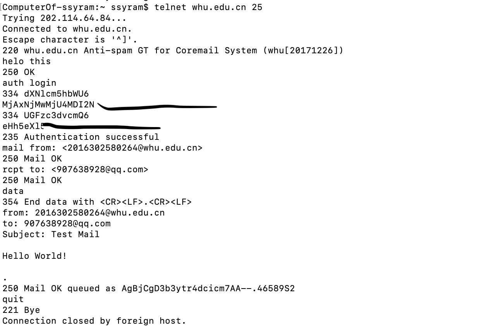

# Report of the Second Homework of Computer Network Course

卓越二班-2016302580264-黎冠延

## `Telnet` for SMTP

## Chapter 2
### P1
F T F F F

### P2
#### Application
DNS & HTTP

#### Transport
(DNS)UDP

(TCP)HTTP

### P5
#### a.
Yes, it found the document successfully.
> HTTP/1.1 200 OK

Time: Tuesday, 07 Mar 2008 12:39:45 Greenwich Mean Time.
> Date: Tue, 07 Mar 2008
12:39:45GMT

#### b.
On Saturday 10 Dec 2005 18:27:46 Greenwich Mean Time.
> Last-Modified: Sat, 10 Dec2005 18:27:46
GMT

#### c.
3874
> Content-Length: 3874

#### d.
"<!doc"
> <!doctype html public ”-
//w3c//dtd html 4.0 transitional//en”>

Yes, but will time out for 100 units of time.
> Keep-Alive: timeout=max=100

### P7

$$ TotalTime =  RTT_0 + \sum_{i = 0}^n RTT_i $$

### P14
#### SMTP
"\<CR\>\<LF\>."
That is: a new line with just a doc as content.

#### HTTP
"Content length header field"

#### HTTP cannot use the same ending manner as SMTP
HTTP may contain binary data, while SMTP just contains the string of 7-bit ASCII characters.
