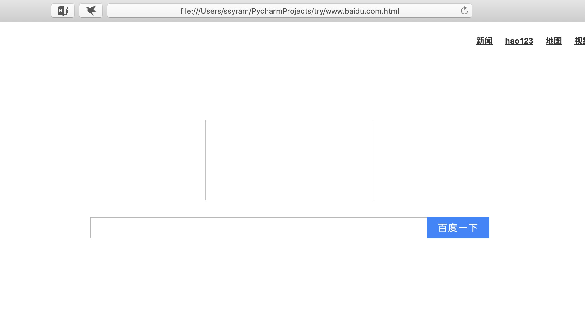

# Report of Third Homework of Computer Network Course
<center>卓越二班-2016302580264-黎冠延</center>

## `tcp` Program

### Codes
``` python
import socket
import os


def open_local_page(address):  # HTTP address
    s = socket.socket(socket.AF_INET, socket.SOCK_STREAM)
    s.connect((address, 80))
    s.send(('GET / HTTP/1.1\r\nHost: ' +
            address +
            '\r\nConnection: close\r\n\r\n')
            .encode('utf8')
          )
    buffer = []
    while True:
        d = s.recv(1024)
        if d:
            buffer.append(d)
        else:
            break
    try:
        data = b''.join(buffer)
    except TypeError:
        print('cannot get content')
        return
    s.close()
    hdr, cntnt = data.split(b'\r\n\r\n', 1)
    print('Succeeded in receiving page in: ' + address)
    print('Header:')
    print(hdr.decode('utf-8'))
    with open(address + '.html', 'wb') as f:
        f.write(cntnt)
    os.system('open ' + address + '.html')


if __name__ == '__main__':
    open_local_page('www.baidu.com')

```

### Result
```
Succeeded in receiving page in: www.baidu.com
Header:
HTTP/1.1 200 OK
Date: Tue, 19 Mar 2019 12:18:01 GMT
Content-Type: text/html
Content-Length: 14615
Last-Modified: Mon, 04 Mar 2019 08:00:31 GMT
Connection: Close
Vary: Accept-Encoding
Set-Cookie: BAIDUID=F6C4CB634D251FB08B881EF6B0DA7B70:FG=1; expires=Thu, 31-Dec-37 23:55:55 GMT; max-age=2147483647; path=/; domain=.baidu.com
Set-Cookie: BIDUPSID=F6C4CB634D251FB08B881EF6B0DA7B70; expires=Thu, 31-Dec-37 23:55:55 GMT; max-age=2147483647; path=/; domain=.baidu.com
Set-Cookie: PSTM=1552997881; expires=Thu, 31-Dec-37 23:55:55 GMT; max-age=2147483647; path=/; domain=.baidu.com
P3P: CP=" OTI DSP COR IVA OUR IND COM "
ETag: "5c7cdb1f-3917"
Server: BWS/1.1
X-UA-Compatible: IE=Edge,chrome=1
Pragma: no-cache
Cache-control: no-cache
Accept-Ranges: bytes
```


## Chapter 3
### P1
|Question|Source -> Destination|Source Port|Destination Port|
|---|----|-----|-----|
|(a)|A=>S|123|23|
|(b)|B=>S|456|23|
|(c\)|S=>B|23|456|
|(d)|S=>A|23|123|

(e) Yes, because the IP is different

(f) No

### P2
Set the IP of A, B, C is a, b, c respectively.

|Flow|IPSA: SP|SPDA: DP|
|---|--|--|
|B => C: 7532|b: 80|c: 7532|
|B => C: 26145|b: 80|c: 26145|
|B => A|b: 80|a: 26145|

### P3
#### Codes
``` C++
template <
  typename ContainerTp,
  typename NumTp = std::decay_t<
    decltype(std::declval<ContainerTp>().operator[](0U))
  >
>
NumTp get_Checksum(const ContainerTp &c) {
  NumTp r = 0;
  for (size_t i = 0; i < c.size(); ++i) {
    const auto &o = c[i];
    r += o + (o > ~NumTp(0) - r);
  }
  return r == ~NumTp(0) ? r : ~NumTp(0) ^ r;
}
template <typename t>
void print_binary(const t &o) {
    char *c = (char *)&o;
    for (size_t i = sizeof(o) - 1; i < sizeof(o); --i) {
        for (char j = 7; j >= 0; --j)
            cout << !!(c[i] & char(1 << j));
        std::cout << " ";
    }
    std::cout << std::endl;
}
int main() {
  std::vector<unsigned char> vs = {0b01010011, 0b01100110, 0b01110100};
  print_binary(get_Checksum(vs));
}
```
<!--**-->
#### Result
11010001

#### Answer
To simplify the process -- there is actually no need for the receiver to find out which is the checksum, but just add all of them together and just find out if there is any bit that is not 1.

All 1-bit errors can be detected, but 2 bit errors may get lost.

### P4
By the program in P3, get:

1. 00111110
2. 10111111
3. 01011101 and 01100100

### P5
No, because checksum can only provide weak check -- as what happened in P4, if two bits are fliped, which is not so seldom in hardware implementation, they may still have the same checksum.
